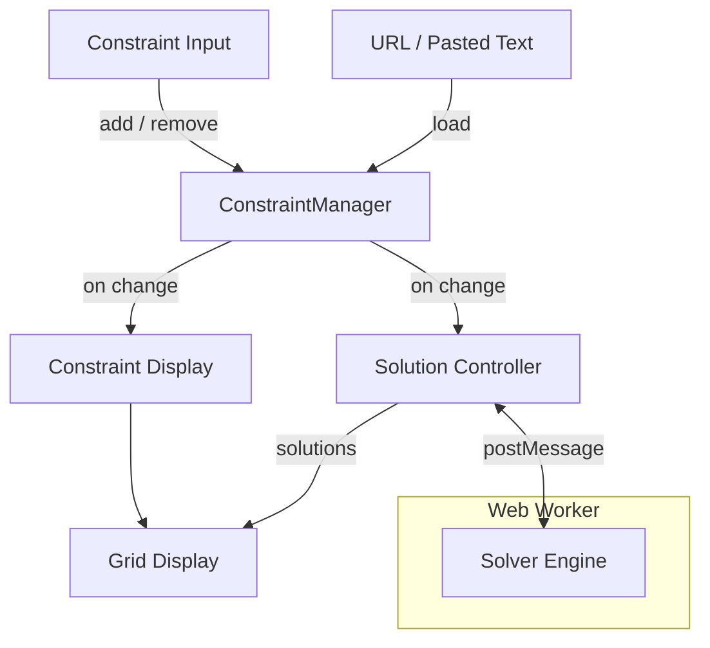

# js/ — Application Source

This directory contains all JavaScript source for the Interactive Sudoku Solver.
The application runs entirely in the browser with no server-side component.

## Architecture Overview

The code is organized around a few key areas:

- **Constraint model** ([sudoku_constraint.js](sudoku_constraint.js)) — ~70 constraint types with serialization, parsing, and display metadata. This is the shared vocabulary used by the UI, parser, display, and solver.
- **UI** ([constraint_input.js](constraint_input.js), [constraint_display.js](constraint_display.js), [display.js](display.js)) — SVG grid rendering, constraint visualization, and input controls.
- **Solver** ([solver/](solver/)) — A constraint-satisfaction engine that runs in a Web Worker. See [solver/README.md](solver/README.md).
- **Orchestration** ([render_page.js](render_page.js), [solution_controller.js](solution_controller.js), [solver_runner.js](solver_runner.js)) — Wires everything together: manages state, coordinates solving, and handles URL-based history.

### Entry Point

[index.html](../index.html) loads scripts as ES modules and calls `initPage()` from [render_page.js](render_page.js) on load. Scripts are preloaded asynchronously (except on Safari, where they load synchronously).

### Data Flow

The `ConstraintManager` (defined in [render_page.js](render_page.js)) is the central hub. It holds the active constraint tree and notifies listeners when it changes.

1. **Input**: The user interacts with [constraint_input.js](constraint_input.js) controls, which create constraint objects (from [sudoku_constraint.js](sudoku_constraint.js)) and add them to the `ConstraintManager`.
2. **Display**: On each update, [constraint_display.js](constraint_display.js) re-renders constraints as SVG overlays on the grid managed by [display.js](display.js).
3. **Solving**: [solution_controller.js](solution_controller.js) receives the constraint tree from the manager and passes it to [solver_runner.js](solver_runner.js), which sends it to [solver_worker.js](solver_worker.js) via `postMessage`. The worker builds and runs the solver engine ([solver/](solver/)).
4. **Results**: Solutions flow back through `postMessage` and are rendered via [display.js](display.js).
5. **Loading from text**: When loading from a URL or pasting a puzzle string, [sudoku_parser.js](sudoku_parser.js) parses the text into constraint objects, which are then loaded into the `ConstraintManager`.

## Files

| File | Purpose |
|------|---------|
| [render_page.js](render_page.js) | **Entry point.** Initializes all components, wires up event listeners, configures the bottom drawer. Also defines `ConstraintManager`, which holds the active constraint tree and notifies listeners on changes. |
| [display.js](display.js) | SVG rendering system. `DisplayContainer` manages layered SVG groups. Key classes: `CellValueDisplay`, `SolutionDisplay`, `HighlightDisplay`, `GridDisplay`, `BorderDisplay`, `ColorPicker`. |
| [constraint_display.js](constraint_display.js) | Renders constraints as SVG overlays (lines, regions, shading, arrows, dots, etc.). ~18 display item subclasses of `BaseConstraintDisplayItem`. |
| [constraint_input.js](constraint_input.js) | UI controls for adding/configuring constraints. `CollapsibleContainer` for grouped inputs. Auto-saves configuration state. |
| [sudoku_constraint.js](sudoku_constraint.js) | **Constraint model.** `SudokuConstraintBase` is the base class for ~70 constraint types (static inner classes of `SudokuConstraint`). Handles serialization (`.Type~arg1~arg2~cell1~cell2`), deserialization, merging, and metadata (`CATEGORY`, `DESCRIPTION`, `DISPLAY_CONFIG`, `ARGUMENT_CONFIG`). |
| [sudoku_parser.js](sudoku_parser.js) | Multi-format parser. Converts plain-text sudoku strings, killer format, jigsaw format, and the internal dot-notation into constraint objects. Builds an AST and resolves it against the shape. |
| [solution_controller.js](solution_controller.js) | Bridges the constraint manager and solver. Manages solve modes, URL-based history (undo/redo), debug/flame-graph integration, and keyboard shortcuts. |
| [solver_runner.js](solver_runner.js) | Solve mode strategies: `AllPossibilitiesModeHandler`, `AllSolutionsModeHandler`, `StepByStepModeHandler`, `CountModeHandler`, `EstimatedCountModeHandler`. Each mode controls how the worker is invoked and results are processed. |
| [solver_worker.js](solver_worker.js) | Web Worker entry point. Receives `{method, payload}` messages, builds the solver via `SudokuBuilder.build()`, runs solve methods, and posts progress/results back. |
| [user_script_worker.js](user_script_worker.js) | Isolated worker for executing user-written constraint scripts. Compiles pairwise functions and NFA state machines. Used by the sandbox. |
| [grid_shape.js](grid_shape.js) | Grid coordinate system. `GridShape` handles cell indexing (R1C1 format), value ranges, and grid dimensions (1×1 to 16×16). `CellGraph` provides adjacency queries. `VarCellRegistry` manages named variable cells outside the grid. |
| [nfa_builder.js](nfa_builder.js) | NFA construction for state-machine constraints. `NFA` (core automaton), `NFASerializer` (binary/Base64 encoding), `RegexParser` (regex→NFA), `JavascriptNFABuilder` (JS function→NFA). |
| [bottom_drawer.js](bottom_drawer.js) | Tabbed panel UI below the grid. `BottomDrawer` manages tabs (debug, flame graph). `LazyDrawerManager` loads tab modules on demand. |
| [util.js](util.js) | Shared utilities: formatting (`formatTimeMs`, `formatNumberMetric`), array/set operations, bit operations (`countOnes16bit`), SVG/DOM helpers, `Timer`, `BitWriter`/`BitReader`, `Base64Codec`, `deferUntilAnimationFrame`, `memoize`, dynamic file loaders, `sessionAndLocalStorage`. |

## Subdirectories

| Directory | Purpose | README |
|-----------|---------|--------|
| [solver/](solver/) | Constraint-satisfaction solver engine (runs in Web Worker) | [solver/README.md](solver/README.md) |
| [debug/](debug/) | Debug panel, flame graph, and benchmarking tools | [debug/README.md](debug/README.md) |
| [help/](help/) | Auto-generated constraint reference documentation | [help/README.md](help/README.md) |
| [sandbox/](sandbox/) | User code editor and execution environment | [sandbox/README.md](sandbox/README.md) |

## Key Patterns

- **Constraint type hierarchy**: All ~70 constraint types are static inner classes of `SudokuConstraint` in [sudoku_constraint.js](sudoku_constraint.js), inheriting from `SudokuConstraintBase`. Each type declares metadata (`CATEGORY`, `DESCRIPTION`, `DISPLAY_CONFIG`, `ARGUMENT_CONFIG`) that drives the UI, help page, and parser automatically.

- **Web Worker isolation**: The solver runs in a dedicated Web Worker ([solver_worker.js](solver_worker.js)) to avoid blocking the UI. Communication is via `postMessage` with `{method, payload}` messages. The worker preloads solver modules asynchronously on startup.

- **SVG rendering**: All grid visuals use SVG elements managed by [display.js](display.js). Display items are layered into named `<g>` groups. Layout updates are batched via `deferUntilAnimationFrame`.

- **URL-based state**: The full puzzle state (constraints, solve mode, options) is encoded in URL query parameters (e.g., `?q=...`). This enables sharing, bookmarking, and history-based undo/redo.

- **Serialization format**: Constraints serialize to a dot-separated string: `.Type~arg1~arg2~cell1~cell2`. Cell IDs use the `R{row}C{col}` format (1-indexed). The parser in [sudoku_parser.js](sudoku_parser.js) also accepts several other input formats (plain text, killer shorthand, jigsaw layout strings).
