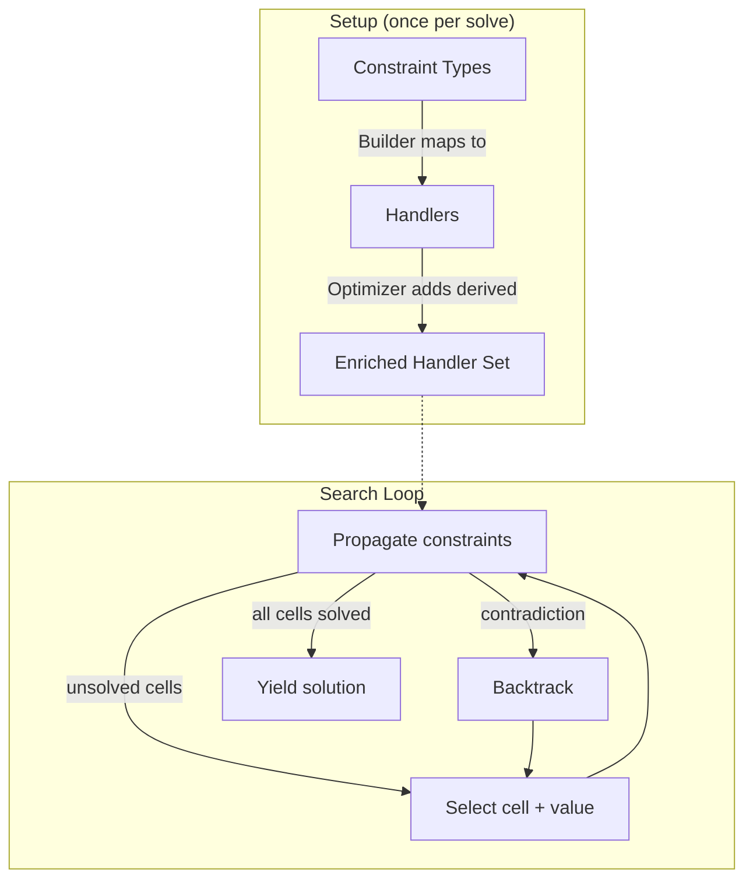

# js/solver/ — Constraint-Satisfaction Solver Engine

This directory contains the solver that finds solutions to Sudoku puzzles with arbitrary constraint combinations. It runs inside a Web Worker (see [../solver_worker.js](../solver_worker.js)) to keep the UI responsive.

For a detailed description of the engine internals (propagation queue, search stack, grid state management, public API), see [SOLVER_ENGINE.md](SOLVER_ENGINE.md).

## How It Works (High Level)

The solver is a **constraint-satisfaction problem (CSP) engine** that uses backtracking search with constraint propagation. The core loop is:

1. Pick the most-constrained unsolved cell (MRV heuristic).
2. Try a candidate value.
3. Propagate constraints — let all affected handlers remove impossible candidates.
4. If a contradiction is found, backtrack and try the next value.
5. If all cells are solved, yield a solution.

Before search begins, an **optimization phase** derives additional constraints that are logically implied by the existing ones. These don't change the solution set but make propagation faster.

## Control Flow

**Setup** (runs once per solve):

1. [solver_worker.js](../solver_worker.js) receives a constraint object and calls `SudokuBuilder.build()`.
2. [sudoku_builder.js](sudoku_builder.js) maps each constraint type to one or more handler instances. Handler classes are defined across [handlers.js](handlers.js), [sum_handler.js](sum_handler.js), and [nfa_handler.js](nfa_handler.js).
3. The `SudokuSolver` (in [engine.js](engine.js)) is created with those handlers. During initialization, [optimizer.js](optimizer.js) analyzes the handlers and adds derived ones for faster propagation.
4. [lookup_tables.js](lookup_tables.js) precomputes bitmask tables used by several handlers.

**Solving** (runs in a loop):

1. [candidate_selector.js](candidate_selector.js) picks the next cell and value to try.
2. The engine sets the cell and propagates — calling `enforceConsistency()` on all affected handlers until no more candidates change (fixed-point).
3. If a contradiction is found, the engine backtracks and tries the next value.
4. If all cells are solved, a solution is yielded.

## Files

| File | Purpose |
|------|---------|
| [engine.js](engine.js) | **Core solver.** `SudokuSolver` is the public API (`countSolutions`, `nthSolution`, `nthStep`, `solveAllPossibilities`). `InternalSolver` implements the search loop with a pre-allocated stack (no recursion). Manages constraint propagation to a fixed point via `HandlerAccumulator`. |
| [handlers.js](handlers.js) | **Constraint handler library.** `SudokuConstraintHandler` is the base class — all handlers implement `enforceConsistency(grid, accumulator)` which removes invalid candidates and returns `false` on contradiction. ~33 handler implementations including `AllDifferent`, `BinaryConstraint`, `House`, `And`, `Or`. |
| [sudoku_builder.js](sudoku_builder.js) | **Constraint-to-handler bridge.** `SudokuBuilder.build(constraint, debugOptions)` converts high-level constraint objects into solver handlers. Contains the mapping from each constraint type (Cage, Arrow, Thermo, etc.) to the handler(s) that enforce it. |
| [optimizer.js](optimizer.js) | **Constraint derivation.** Adds logically-implied handlers that don't change the solution set but speed up propagation: innie/outie sums, cage gap filling, house handlers, jigsaw intersection logic, binary constraint transitivity, combined sums, and more. |
| [candidate_selector.js](candidate_selector.js) | **Search heuristics.** `CandidateSelector` picks which cell to solve next (ranked by conflict score per candidate, falling back to MRV when scores are zero) and which value to try first. `ConflictScores` tracks cells that caused contradictions to improve future ordering. `SeenCandidateSet` deduplicates solutions. |
| [sum_handler.js](sum_handler.js) | **Algebraic sum constraints.** Handles equations of the form `Σ cᵢ·vᵢ = target` with integer coefficients. Used for cages, arrows, pill arrows, and optimizer-derived sums. Groups cells by coefficient. Specialized fast paths for 1–3 remaining unfixed cells. |
| [nfa_handler.js](nfa_handler.js) | **NFA-based sequential constraints.** Enforces constraints on ordered cell sequences (palindromes, whisper lines, regex patterns) using a compressed NFA representation. Uses a forward+backward pass to prune candidates. |
| [lookup_tables.js](lookup_tables.js) | **Precomputed tables.** `LookupTables` provides O(1) bitmask lookups: `sum[mask]` (sum of values in a bitmask), `rangeInfo[mask]` (min/max/isFixed), `reverse[mask]` (complement). Also decodes binary relationship keys for pairwise constraints. |

## Constraint-to-Handler Mapping

[sudoku_builder.js](sudoku_builder.js) contains the mapping from each `SudokuConstraint.*` type to one or more handlers. For example:

- `Cage` → `Sum` handler + `AllDifferent` handler
- `Arrow` → `Sum.makeEqual()` (equality between circle and arrow cells)
- `PillArrow` → `Sum` with negative power-of-10 coefficients
- `AntiKnight` → multiple `BinaryConstraint` instances (one per affected pair)

## Optimization Phase

After handlers are created, [optimizer.js](optimizer.js) analyzes them and adds derived handlers. Examples:

- If a cage covers part of a house, add a handler for the remaining cells (innie/outie).
- If two sums share cells, merge them into a combined sum handler.
- Add `House` handlers (optimized `AllDifferent` for full rows/columns/boxes).
- Derive exclusion relationships from binary constraint transitivity.

Derived handlers are marked non-essential and may be skipped by the solver
in certain places.
